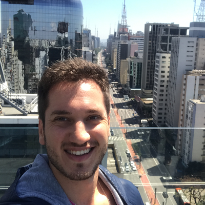

# React-appTask
Projeto feito em ReactJs, desafio do curso ignite da RocektSeat

**Tecnologias :**
ReactJs

**Autor**
Foto | Nome | GitHub | Likedin | E-mail
---- | ---- | ------ | ------- | ------
  | João Lucas Nascimento Andrade | [João Lucas Andrade](https://github.com/Jlucas93) | [Linkedin](https://www.linkedin.com/in/joão-lucas-nascimento-andrade-34574398) | jlnascimentoandrade@gmail.com